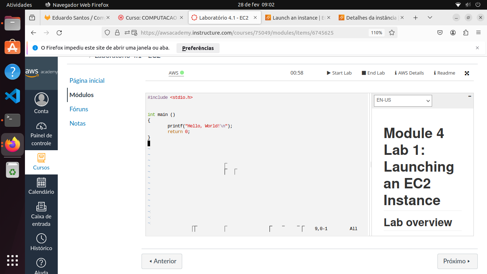
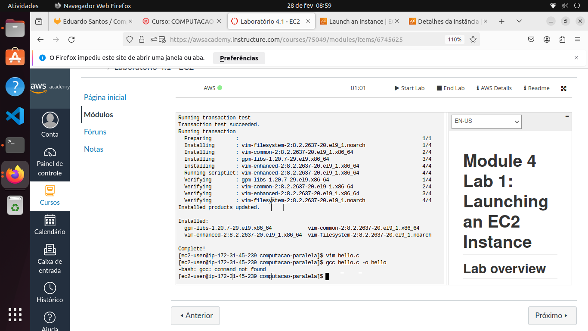
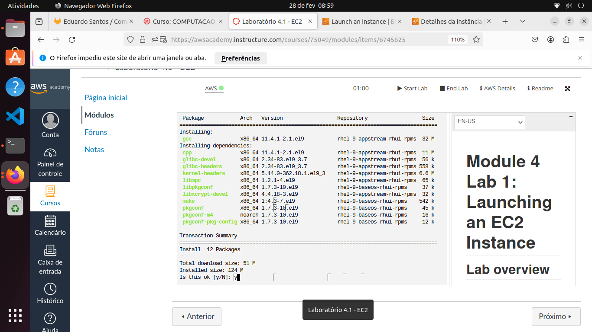

# Lab 01

# 01
### Primeiro, criei um arquivo hello.c e abri com o Vim

# 02
### Em seguinda tentei compilar o programa, porém estava sem o gcc; então tive que instalá-lo

# 03
### Com o gcc instalado, compilei e executei o programa
Compilando com `gcc hello.c -o hello` e executando com `./hello`

# 04
### Na etapa final, faço o commit e o push do arquivo "hello.c" para o repositório.
Executando `git add .`, `git commit -m "mensagem"` e `git push`.

